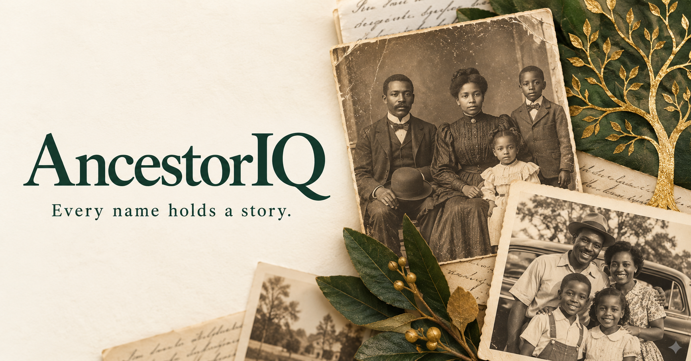

# AncestorIQ

## 🌐 Live Application

**Production Website:** https://ancestoriq.app

AncestorIQ is a cloud-native genealogy research platform that helps individuals discover, connect, and better understand their family history through historical records, cloud computing, and artificial intelligence.

The platform is designed to simplify genealogy research by bringing together historical record collections into a single searchable application while providing historical context and intelligent research assistance.

---

## Latest Development Update — October 3, 2026

* Redesigned the homepage with a cream, forest green, and gold palette.
* Improved responsive layouts and historical record card styling.
* Added a branded image and metadata for social sharing previews.
* Fixed navigation from person profiles back to the homepage.
* Confirmed search works with both the Search button and Enter key.
* Deployed the updated application to Google Cloud Run.
* Preserved recovered loading, staging, and rebuild SQL in the private repository.

### September 18 Recovery

* Restored 346,632 Freedmen’s Bureau source records.
* Restored 12,804 Unknown No Longer people records.
* Rebuilt 316,883 searchable records with unique reference IDs.
* Removed automatic table expiration and restored working search.

### Next Development Focus

Improve candidate matching and build an evidence-grounded genealogy
research prototype using Gemini through Vertex AI, with citations,
uncertainties, and recommended next research steps.

---

## Current Features

### Live Web Application

* Historical genealogy search
* Individual person profile pages
* Cloud-hosted production application
* FastAPI REST API
* Google Cloud Run deployment
* BigQuery-powered search index
* HTTPS-secured custom domain
* Responsive web interface

---

## Mission

To make genealogy research more accessible by combining historical records, cloud engineering, data engineering, and artificial intelligence into a modern research platform.

AncestorIQ is focused on helping researchers navigate records related to slavery, emancipation, Reconstruction, and the Great Migration while making those records easier to search and understand.

---

## The Problem

Tracing African American ancestry presents unique challenges due to incomplete documentation, name changes, migration patterns, and historical record fragmentation.

AncestorIQ is being built to reduce those barriers by providing:

* Unified historical search
* Historical context
* Intelligent record discovery
* AI-assisted genealogy research
* Guided research workflows

---

## Current Platform Statistics

### Historical Search Index

* 316,883 searchable records after the September 18, 2026 rebuild
* 359,436 raw source records across the two restored collections
* 31,000+ unique surnames reported in the initial dataset
* Multiple integrated historical collections
* BigQuery-powered search engine

---

## Current Data Sources

### Integrated

* Freedmen's Bureau Records
* Unknown No Longer Project

### Planned

* 1870 United States Census
* Freedman's Bank Records
* United States Colored Troops
* Library of Congress Collections
* Chronicling America
* Additional Reconstruction-era archives

---

## Technology Stack

### Cloud Platform

* Google Cloud Platform
* Cloud Run
* BigQuery
* Cloud DNS
* Artifact Registry
* Cloud Build

### Backend

* Python
* FastAPI
* REST APIs
* Docker

### Frontend

* HTML
* CSS
* JavaScript

### Planned AI & Analytics

* Gemini through Vertex AI for evidence-grounded research
* Power BI for analytics

AI research features are not yet implemented.

---

## Current Architecture

The browser loads the HTML, CSS, and JavaScript frontend served by
FastAPI on Cloud Run. Search requests go through the API to the
BigQuery historical search index.

Cloud DNS resolves the custom domain. Cloud Build builds the Docker
container image, Artifact Registry stores it, and Cloud Run runs it.

Historical source data is retained separately in Cloud Storage.

---

## June 2026 Milestones

### Infrastructure

* Registered production domain (`ancestoriq.app`)
* Configured Google Cloud DNS
* Connected custom domain to Cloud Run
* Enabled HTTPS production deployment

### Application

* Built the first public web interface
* Added historical search functionality
* Added person profile pages
* Connected frontend to the live FastAPI backend
* Deployed the first public version of AncestorIQ

### Data Platform

* Unified multiple genealogy collections
* Indexed more than 359,000 historical records
* Built a searchable BigQuery historical index

---

## Project Roadmap

Upcoming features include:

* Advanced search filters
* Family relationship discovery
* Historical migration visualization
* Interactive family timelines
* Historical record images
* AI-generated record explanations
* Source citation improvements
* Family tree generation
* Intelligent genealogy research assistant

---

## Repository Purpose

This repository showcases the architecture, documentation, roadmap, screenshots, and overall vision of the AncestorIQ platform.

The production application source code is maintained in a separate private repository.

---

## Status

**Actively Developed**

AncestorIQ has evolved from a historical data indexing project into a live cloud-native genealogy application. Development is focused on expanding historical collections, improving search capabilities, and building AI-powered genealogy research tools.
